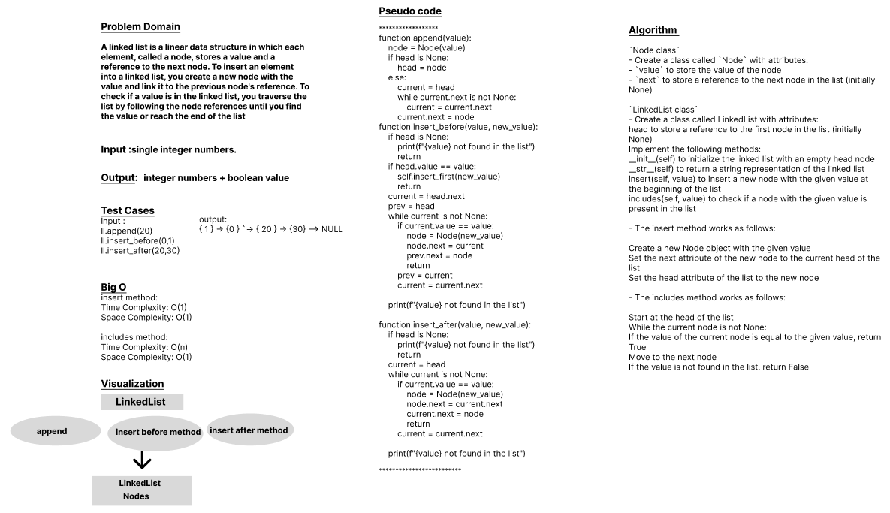

# Code Challenge: Class-06
# Linked-List-Insertions
A linked list is a linear data structure in which each element, called a node, stores a value and a reference to the next node. This Code uses to insert an element into a linked list, create a new node with the value and link it to the previous node's reference. To check if a value is in the linked list, traverse the list by following the node references until find the value or reach the end of the list.

## Whiteboard Process

## Approach & Efficiency
## 1. Algorithm :
`Node class`
- Create a class called `Node` with attributes:
- `value` to store the value of the node
- `next` to store a reference to the next node in the list (initially None)

`LinkedList class`
- Create a class called LinkedList with attributes:
 
 head to store a reference to the first node in the list (initially None)
    Implement the following methods:
     __init__(self) to initialize the linked list with an empty head node
     __str__(self) to return a string representation of the linked list
     insert(self, value) to insert a new node with the given value at the beginning of the list
     includes(self, value) to check if a node with the given value is present in the list

append: This method adds an element to the end of a list or array. 

insert before: This method inserts an element into a list or array before a specified position. 

insert after: This method inserts an element into a list or array after a specified position. 

## 2. BigO
   append method: Time Complexity: O(1) (amortized), Space Complexity: O(1)
   insert before method: Time Complexity: O(n), Space Complexity: O(1)
   insert after method: Time Complexity: O(n), Space Complexity: O(1)

## Solution
### [click here to the LinkedList code](./linked-list-insertions.py)
### [click here to the Test code](../tests/test_linkedlist%7C%7C.py)
### To run the code:
    -on your terminal follow these command:
       1. source .venv/bin/activate.
       2. pip install pytest.
       3. pytest.