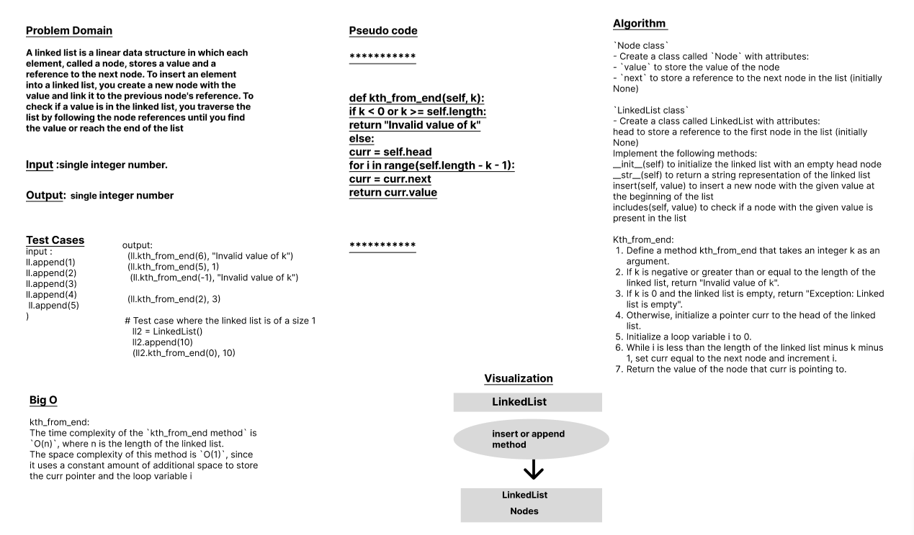

# Code Challenge: Class-07
# Linked-List-Kth
A linked list is a linear data structure in which each element, called a node, stores a value and a reference to the next node. This Code uses to insert an element into a linked list, create a new node with the value and link it to the previous node's reference. To check if a value is in the linked list, traverse the list by following the node references until find the value or reach the end of the list.

## Whiteboard Process

## Approach & Efficiency
## 1. Algorithm :
`Node class`
- Create a class called `Node` with attributes:
- `value` to store the value of the node
- `next` to store a reference to the next node in the list (initially None)

`LinkedList class`
- Create a class called LinkedList with attributes:
 
 head to store a reference to the first node in the list (initially None)
    Implement the following methods:
     __init__(self) to initialize the linked list with an empty head node
     __str__(self) to return a string representation of the linked list
     insert(self, value) to insert a new node with the given value at the beginning of the list
     includes(self, value) to check if a node with the given value is present in the list

    kth_from_end: The method takes an argument k, which represents the index of the node to be returned from the end of the linked list.
    If k is negative or greater than or equal to the length of the linked list, the method returns the message "Invalid value of k", 
    indicating that k is not a valid index for the linked list.
    Finally, the method returns the value of the node that curr is pointing to.

## 2. BigO
  
The time complexity of the `kth_from_end method` is `O(n)`, where n is the length of the linked list.
The space complexity of this method is `O(1)`, since it uses a constant amount of additional space to store the curr pointer and the loop variable i

## Solution
### [click here to the LinkedList code](./LLKth.py)
### [click here to the Test code](../tests/test_linkedlist3.py)
### To run the code:
    -on your terminal follow these command:
       1. source .venv/bin/activate.
       2. pip install pytest.
       3. pytest.