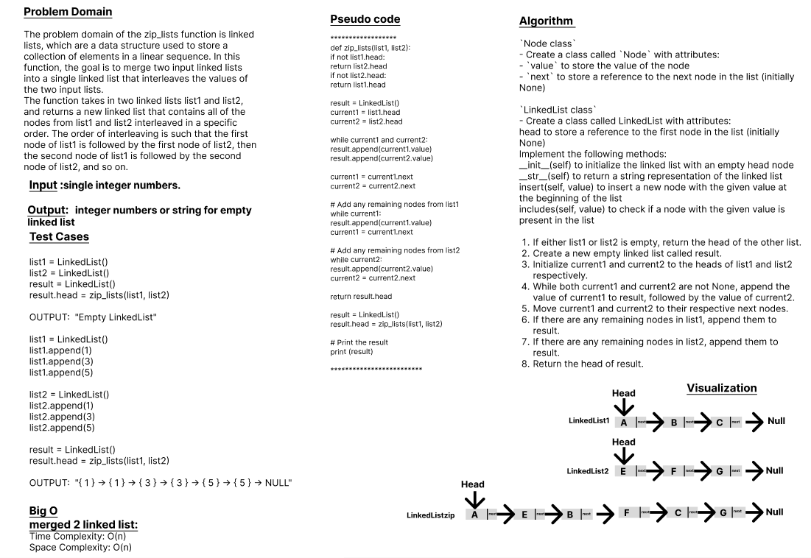

# Code Challenge: Class-08
# Linked-List-zip
`zip_lists` function is linked lists, which are a data structure used to store a collection of elements in a linear sequence. In this function, the goal is to merge two input linked lists into a single linked list that interleaves the values of the two input lists.

## Whiteboard Process

## Approach & Efficiency
## 1. Algorithm :
`Node class`
- Create a class called `Node` with attributes:
- `value` to store the value of the node
- `next` to store a reference to the next node in the list (initially None)

`LinkedList class`
- Create a class called LinkedList with attributes:
 
 head to store a reference to the first node in the list (initially None)
    Implement the following methods:
     __init__(self) to initialize the linked list with an empty head node
     __str__(self) to return a string representation of the linked list
     insert(self, value) to insert a new node with the given value at the beginning of the list
     includes(self, value) to check if a node with the given value is present in the list

- Merged two linked-list

   If either list1 or list2 is empty, return the head of the other list.

   Create a new empty linked list called result.

   Initialize current1 and current2 to the heads of list1 and list2 respectively.

   While both current1 and current2 are not None, append the value of current1 to result, followed by the value of current2.

   Move current1 and current2 to their respective next nodes.

   If there are any remaining nodes in list1, append them to result.

  If there are any remaining nodes in list2, append them to result.
   
  Return the head of result.

## 2. BigO
  
The time complexity of the `zip_lists` is `O(n)`, where n is the length of the linked list.
The space complexity of this method is `O(n)`.

## Solution
### [click here to the LinkedList code](./LLzip.py)
### [click here to the Test code](../tests/test_linkedlist4.py)
### To run the code:
    -on your terminal follow these command:
       1. source .venv/bin/activate.
       2. pip install pytest.
       3. pytest.