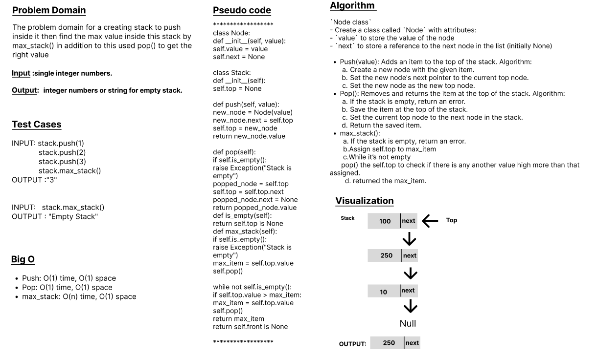

# Code Challenge: Class-14
# Stack
A stack is a Last-In-First-Out (LIFO) data structure in which the last element added is the first one to be removed. The main operations performed on a stack are push (add an element to the top) and pop (remove the top element). Other common operations include peek (return the top element without removing it) and isEmpty (check if the stack is empty).

The problem domain for a creating stack to push inside it then find the max value inside this stack by max_stack() in addition to this used pop() to get the right value

## Whiteboard Process

## Approach & Efficiency
## 1. Algorithm :
`Node class`
- Create a class called `Node` with attributes:
- `value` to store the value of the node
- `next` to store a reference to the next node in the list (initially None)

- Push(value): Adds an item to the top of the stack. Algorithm:
        a. Create a new node with the given item.
        b. Set the new node's next pointer to the current top node.
        c. Set the new node as the new top node.

- Pop(): Removes and returns the item at the top of the stack. Algorithm:
        a. If the stack is empty, return an error.
        b. Save the item at the top of the stack.
        c. Set the current top node to the next node in the stack.
        d. Return the saved item.

- max_stack():
       a. If the stack is empty, return an error.
       b.Assign self.top to max_item
       c.While it’s not empty
      pop() the self.top to check if there is any another value high more than that assigned.
        d. returned the max_item.

## 2. BigO
Push: O(1) time, O(1) space
Pop: O(1) time, O(1) space
max_stack: O(n) time, O(1) space

## Solution
### [click here to the stack and queues code](./max_stack.py)

### To run the code:
    -on your terminal follow these command:
       1. source .venv/bin/activate.
       2. pip install pytest.
       3. pytest.