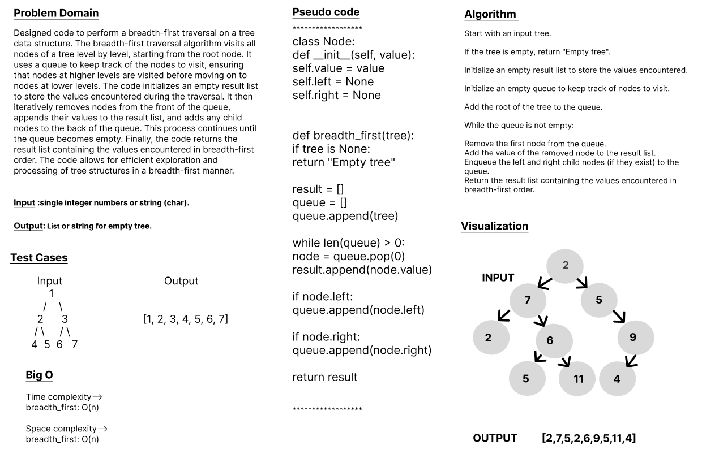

# Code Challenge: Class-17
## tree-breadth-first
## Problem Domain
Designed code to perform a breadth-first traversal on a tree data structure. The breadth-first traversal algorithm visits all nodes of a tree level by level, starting from the root node. It uses a queue to keep track of the nodes to visit, ensuring that nodes at higher levels are visited before moving on to nodes at lower levels. The code initializes an empty result list to store the values encountered during the traversal. It then iteratively removes nodes from the front of the queue, appends their values to the result list, and adds any child nodes to the back of the queue. This process continues until the queue becomes empty. Finally, the code returns the result list containing the values encountered in breadth-first order. The code allows for efficient exploration and processing of tree structures in a breadth-first manner.

## Whiteboard Process

## Approach & Efficiency
1. Algorithm :

Start with an input tree.

If the tree is empty, return "Empty tree".

Initialize an empty result list to store the values encountered.

Initialize an empty queue to keep track of nodes to visit.

Add the root of the tree to the queue.

While the queue is not empty:

Remove the first node from the queue.
Add the value of the removed node to the result list.
Enqueue the left and right child nodes (if they exist) to the queue.
Return the result list containing the values encountered in breadth-first order.

2. BigO
Here are the time complexity (big O) for various operations:

    breadth_first: O(n) 

Here are the space complexity (big O) for various operations:

    breadth_first: O(n) 

## Solution
### [click here to the code](./breath_first.py)
### [click here to the Test code](../tests/tests_TBF.py)

## Test Cases
          Input	                                 Output
            1
         /     \
        2       3                         [1, 2, 3, 4, 5, 6, 7]
       / \     / \
      4   5   6   7              

### To run the code:
-on your terminal follow these command:
   1. source .venv/bin/activate.
   2. pip install pytest.
   3. pytest.