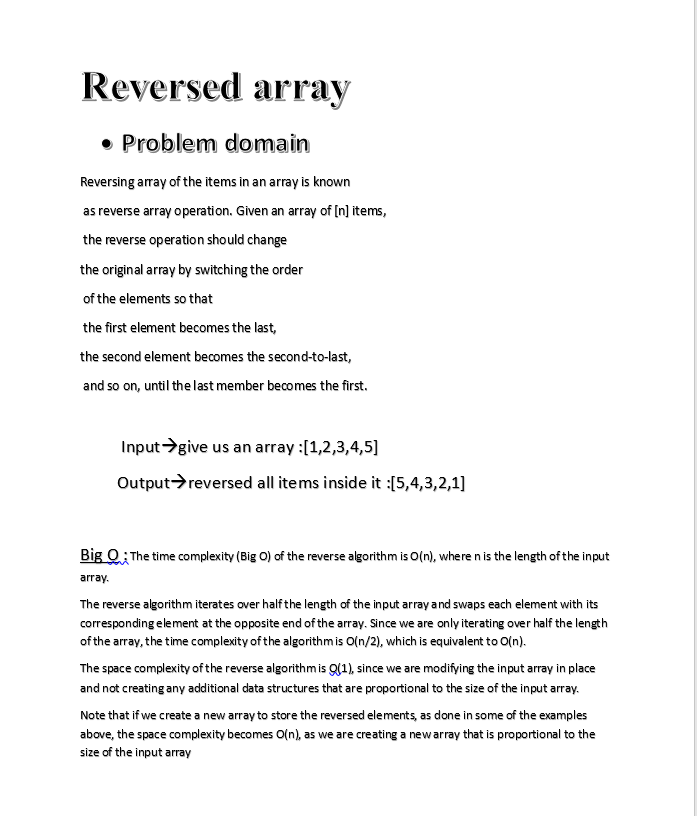
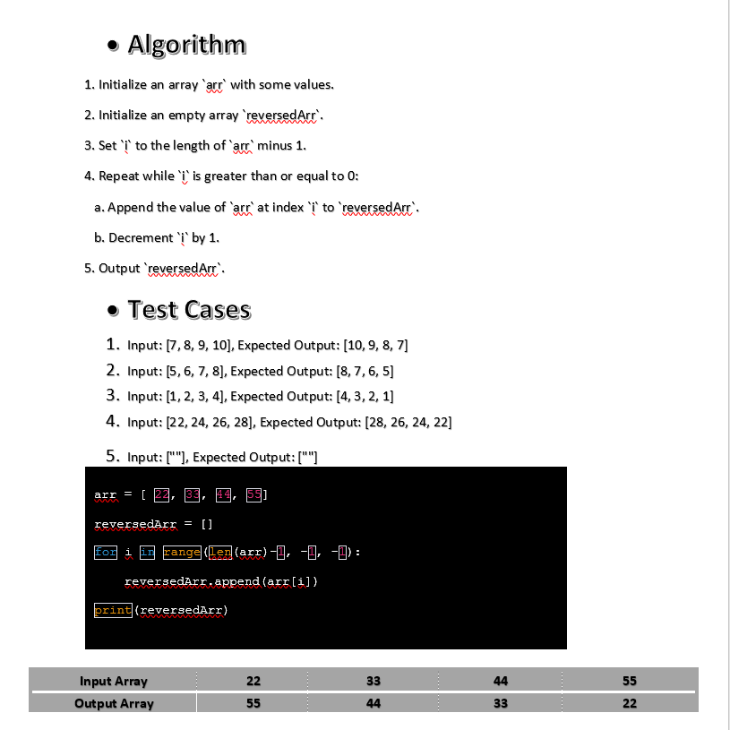

# Code Challenge: Class 01
## Reversed Array 
A reversed array is an array that has its elements in the reverse order compared to the original array.

## Whiteboard Process

## Approach & Efficiency
### Big O : 
The time complexity (Big O) of the reverse algorithm is O(n), where n is the length of the input array.
The reverse algorithm iterates over half the length of the input array and swaps each element with its corresponding element at the opposite end of the array. Since we are only iterating over half the length of the array, the time complexity of the algorithm is O(n/2), which is equivalent to O(n).
The space complexity of the reverse algorithm is O(1), since we are modifying the input array in place and not creating any additional data structures that are proportional to the size of the input array.
Note that if we create a new array to store the reversed elements, as done in some of the examples above, the space complexity becomes O(n), as we are creating a new array that is proportional to the size of the input array
### Algorithm :
1. Initialize an array `arr` with some values.
2. Initialize an empty array `reversedArr`.
3. Set `i` to the length of `arr` minus 1.
4. Repeat while `i` is greater than or equal to 0:
   a. Append the value of `arr` at index `i` to `reversedArr`.
   b. Decrement `i` by 1.
5. Output `reversedArr`.

## Solution
	Input: [7, 8, 9, 10], Expected Output: [10, 9, 8, 7]
	Input: [5, 6, 7, 8], Expected Output: [8, 7, 6, 5]
	Input: [1, 2, 3, 4], Expected Output: [4, 3, 2, 1]
    Input: [22, 24, 26, 28], Expected Output: [28, 26, 24, 22]
    Input: [""], Expected Output: [""]
