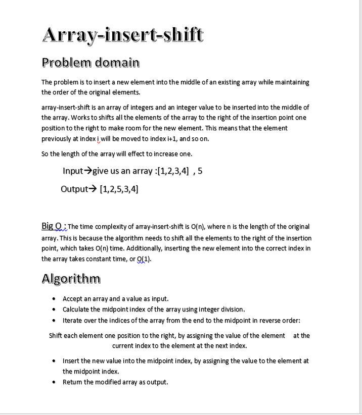
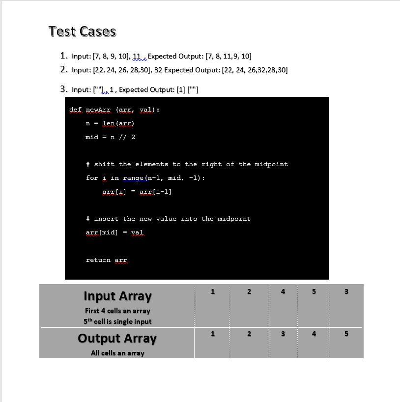

# Code Challenge: Class-02
## Array-insert-shift
Array-insert-shift is an array of integers and an integer value to be inserted into the middle of the array. Works to shifts all the elements  which is means that the element previously at index i will be moved to index i+1, and so on.

## Whiteboard Process

## Approach & Efficiency
### Big O : The time complexity of array-insert-shift is O(n), where n is the length of the original array. This is because the algorithm needs to shift all the elements to the right of the insertion point, which takes O(n) time. Additionally, inserting the new element into the correct index in the array takes constant time, or O(1). 

### Algorithm :
•	Accept an array and a value as input.

•	Calculate the midpoint index of the array using integer division.

•	Iterate over the indices of the array from the end to the midpoint in reverse order:  Shift each element one position to the right, by assigning the value of the element at the current index to the element at the next index.

•	Insert the new value into the midpoint index, by assigning the value to the element at the midpoint index.

•	Return the modified array as output.

## Solution

	Input:[7, 8, 9, 10], 11,    Expected Output:[7, 8, 11,9, 10]

	Input:[22, 24, 26, 28,30],32,
    Expected Output:[22, 24, 26,32,28,30]
    
	Input: [""] , 1 , Expected Output: [1] [""]

