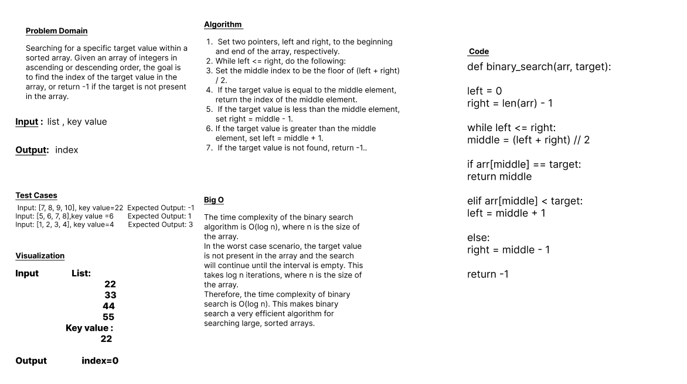

# Code Challenge: Class 03
## Array-binary-search
`Binary search` is a search algorithm that works efficiently on sorted arrays. It repeatedly divides the search interval in half until the target element is found or determined to be not present. It has a time complexity of O(log n) where n is the size of the array.

## Whiteboard Process

## Approach & Efficiency
### Big O : The time complexity of the binary search algorithm is O(log n), where n is the size of the array.
In the worst case scenario, the target value is not present in the array and the search will continue until the interval is empty. This takes log n iterations, where n is the size of the array.
Therefore, the time complexity of binary search is O(log n). This makes binary search a very efficient algorithm for searching large, sorted arrays

### Algorithm :
1.	Set two pointers, left and right, to the beginning and end of the array, respectively.
2.	While left <= right, do the following:
3.	Set the middle index to be the floor of (left + right) / 2.
4.	If the target value is equal to the middle element, return the index of the middle element.
5.	If the target value is less than the middle element, set right = middle - 1.
6.	If the target value is greater than the middle element, set left = middle + 1.
7.	If the target value is not found, return -1.

## Solution

	1.	Input: [7, 8, 9, 10], key value =22       Expected Output: -1
    2.	Input: [5, 6, 7, 8], key value =6         Expected Output: 1
    3.	Input: [1, 2, 3, 4], key value =4         Expected Output: 3
    4.	Input: [22, 24, 26, 28], key value =22    Expected Output: 0
