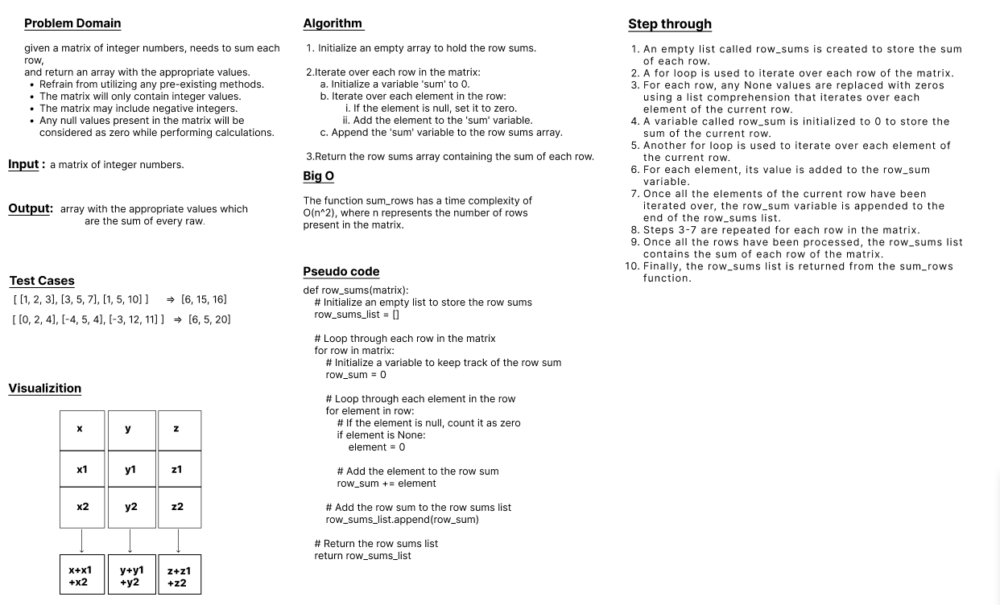

# Code Challenge: Class 04
## Sum-Matrix
### given a matrix of integer numbers, needs to sum each row,
and return an array with the appropriate values.

## Whiteboard Process

## Approach & Efficiency
### Big O : 
The function sum_rows has a time complexity of O(n^2), where n represents the number of rows present in the matrix.

### Algorithm :
1.	Initialize an empty array to hold the row sums.

2. Iterate over each row in the matrix: 
      a. Initialize a variable 'sum' to 0.
      b. Iterate over each element in the row:
               i. If the element is null, set it to zero. 
              ii. Add the element to the 'sum' variable.
      c. Append the 'sum' variable to the row sums array.

3. Return the row sums array containing the sum of each row.

## Solution

	1. [ [1, 2, 3], [3, 5, 7], [1, 5, 10] ]      =>  [6, 15, 16]
    2. [ [0, 2, 4], [-4, 5, 4], [-3, 12, 11] ]   =>  [6, 5, 20]
