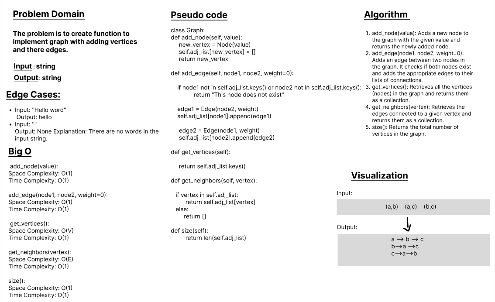

# class 35 - Graph

 a graph refers to a specific type of data structure that consists of a set of vertices connected by edges. It is a fundamental data structure used to represent relationships or connections between objects.

Graphs can be visualized as diagrams where the vertices are represented by points or circles, and the edges are represented by lines or arrows connecting the vertices. The edges can be directed (indicating a one-way connection) or undirected (indicating a two-way connection).

## Whiteboard Process

## Approach & Efficiency

### add_node(value):
    Space Complexity: O(1) 
    Time Complexity: O(1) 

### add_edge(node1, node2, weight=0):
    Space Complexity: O(1) 
    Time Complexity: O(1) 

### get_vertices():
    Space Complexity: O(V) 
    Time Complexity: O(1)
### get_neighbors(vertex):
    Space Complexity: O(E) 
    Time Complexity: O(1) 
### size():
    Space Complexity: O(1) 
    Time Complexity: O(1) 

## Solution
### [click here to the  code](./graph.py)
### [click here to the Test code](../tests/test_graph.py)