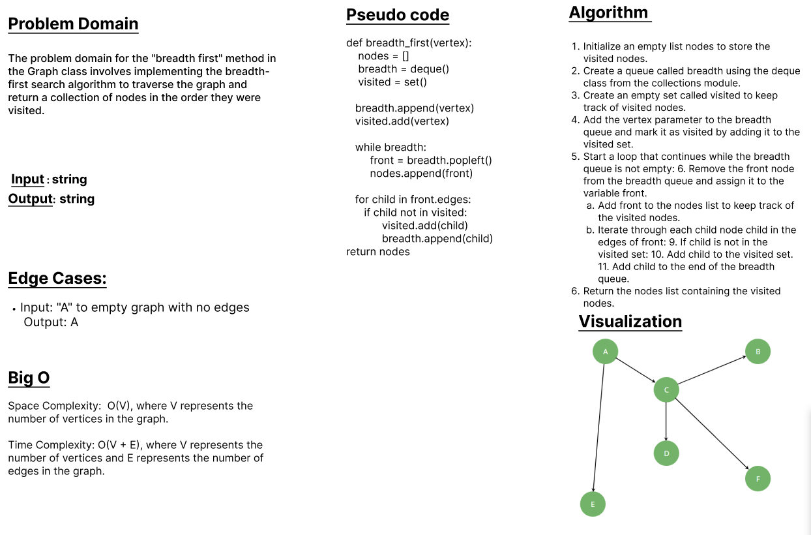

# class 35 - graph_breadth_first

Implementing the breadth-first search algorithm to traverse the graph and return a collection of nodes in the order they were visited.

## Whiteboard Process

## Approach & Efficiency
        - The code starts by initializing an empty list nodes to store the visited nodes, a queue breadth using the deque class to keep track of nodes to visit, and a set visited to mark visited nodes.
        - It adds the vertex parameter to the breadth queue and marks it as visited by adding it to the visited set.
        - The code enters a while loop that continues as long as the breadth queue is not empty.
        - Inside the loop, it removes the front node from the breadth queue using popleft() and appends it to the nodes list.
        - For each child node connected to the front node, it checks if the child has not been visited yet. If not, it adds the child to the   visited set and appends it to the end of the breadth queue.
        - Finally, it returns the nodes list containing the visited nodes.

### BigO:
    Space Complexity: O(1) 
    Time Complexity: O(1) 

## Solution
### [click here to the  code](./graph_breadth_first.py)
### [click here to the Test code](../tests/test_graph_breath_first.py)