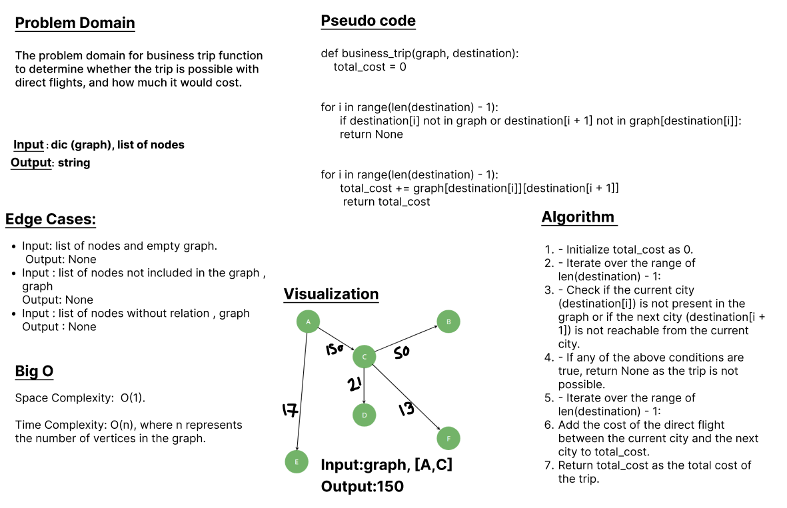

# class 37 - graph-business-trip

Implementing business trip function to determine whether the trip is possible with direct flights, and how much it would cost.

## Whiteboard Process

## Approach & Efficiency
   - Initialize total_cost as 0.
   - Iterate over the range of len(destination) - 1:
   - Check if the current city (destination[i]) is not present in the graph or if the next city (destination[i + 1]) is not reachable from the current city.
   - If any of the above conditions are true, return None as the trip is not possible.
   - Iterate over the range of len(destination) - 1:
        Add the cost of the direct flight between the current city and the next city to total_cost.
        Return total_cost as the total cost of the trip.

### BigO:
    Space Complexity: O(1) 
    Time Complexity: O(n) 

## Solution
### [click here to the  code](./graph_business_trip.py)
### [click here to the Test code](../tests/test_graph_business_trip.py)