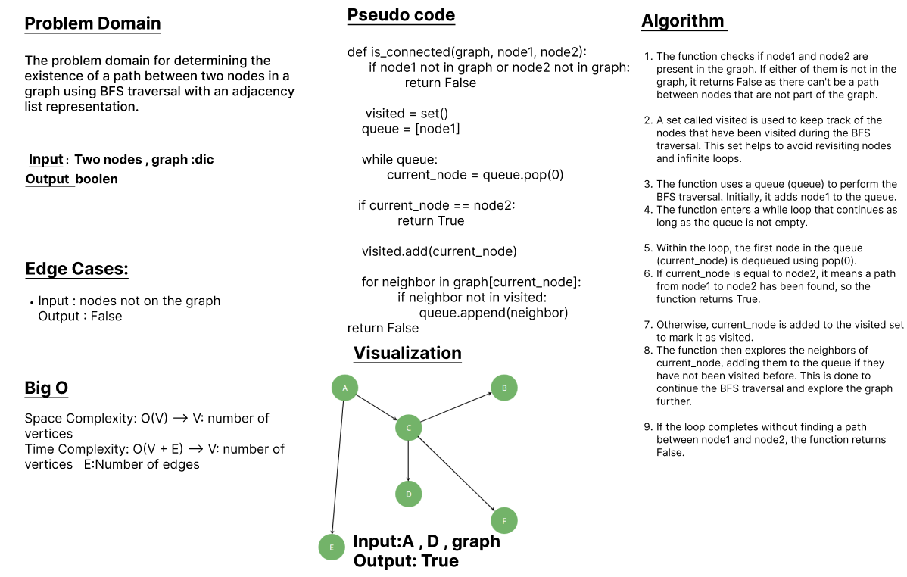

# class 39 - Graph_connected_nodes

The problem domain for determining the existence of a path between two nodes in a graph using BFS traversal with an adjacency list representation.

## Whiteboard Process

## Approach & Efficiency
The function checks if node1 and node2 are present in the graph. If either of them is not in the graph, it returns False as there can't be a path between nodes that are not part of the graph.

A set called visited is used to keep track of the nodes that have been visited during the BFS traversal. This set helps to avoid revisiting nodes and infinite loops.

The function uses a queue (queue) to perform the BFS traversal. Initially, it adds node1 to the queue.

The function enters a while loop that continues as long as the queue is not empty.

Within the loop, the first node in the queue (current_node) is dequeued using pop(0).

If current_node is equal to node2, it means a path from node1 to node2 has been found, so the function returns True.

Otherwise, current_node is added to the visited set to mark it as visited.

The function then explores the neighbors of current_node, adding them to the queue if they have not been visited before. This is done to continue the BFS traversal and explore the graph further.

If the loop completes without finding a path between node1 and node2, the function returns False.

 

## Solution
### [click here to the  code](./graph_connected_nodes.py)
### [click here to the Test code](../tests/test_graph.py)