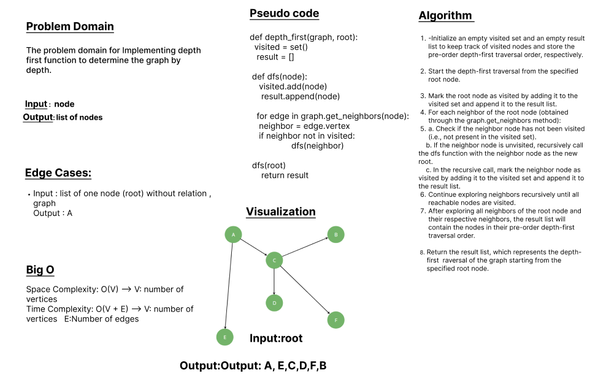

# class 38 - graph-depth-first

Implementing depth first function to determine the graph by depth.

## Whiteboard Process

## Approach & Efficiency
1. Initialize an empty visited set and an empty result list to keep track of visited nodes and store the pre-order depth-first traversal order, respectively.

2. Start the depth-first traversal from the specified root node.

3. Mark the root node as visited by adding it to the visited set and append it to the result list.

4. For each neighbor of the root node (obtained through the graph.get_neighbors method):

    a. Check if the neighbor node has not been visited (i.e., not present in the visited set).

    b. If the neighbor node is unvisited, recursively call the dfs function with the neighbor node as the new root.

    c. In the recursive call, mark the neighbor node as visited by adding it to the visited set and append it to the result list.

5. Continue exploring neighbors recursively until all reachable nodes are visited.

6. After exploring all neighbors of the root node and their respective neighbors, the result list will contain the nodes in their pre-order depth-first traversal order.

7. Return the result list, which represents the depth-first traversal of the graph starting from the specified root node.

### BigO:
    Space Complexity: O(V) --> V: number of vertices
    Time Complexity: O(V + E) --> V: number of vertices   E:Number of edges

## Solution
### [click here to the  code](./depth_first.py)
### [click here to the Test code](../tests/test_graph_depth_first.py)