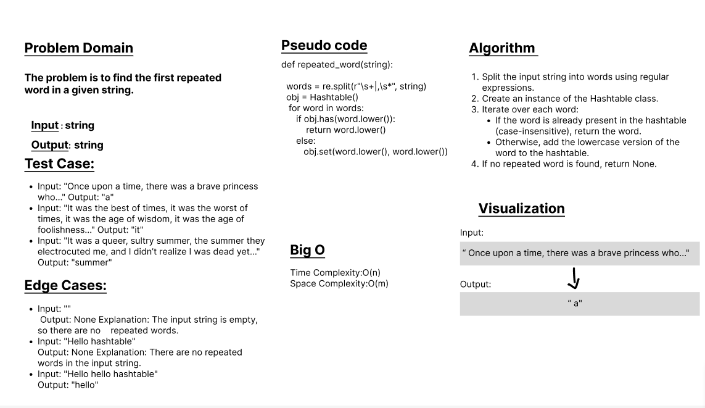

# Class 31
## The problem is to find the first repeated word in a given string.
## Whiteboard Process

## Algorithm:

        Split the input string into words using regular expressions.
        Create an instance of the Hashtable class.
        Iterate over each word:
        If the word is already present in the hashtable (case-insensitive), return the word.
        Otherwise, add the lowercase version of the word to the hashtable.
        If no repeated word is found, return None.

## Test Cases:

        Input: "Once upon a time, there was a brave princess who..."
        Output: "a"
        Input: "It was the best of times, it was the worst of times, it was the age of wisdom, it was the age of foolishness..."
        Output: "it"
        Input: "It was a queer, sultry summer, the summer they electrocuted me, and I didn’t realize I was dead yet..."
        Output: "summer"

## Edge Cases:

    Input: ""
    Output: None Explanation: The input string is empty, so there are no repeated words.

    Input: "Hello hashtable" 
    Output: None Explanation: There are no repeated words in the input string.

    Input: "Hello hello hashtable"
    Output: "hello" 

## Time Complexity:
The time complexity of the repeated_word function is O(n).

## Space Complexity:
The space complexity of the repeated_word function is O(m), where m is the number of unique words in the input string.
## Solution
### [click here to the code](./hashmap_repeatedword.py)
### [click here to the Test code](../../tests/test_repetedwords.py)
### To run the code:
    -on your terminal follow these command:
       1. source .venv/bin/activate.
       2. pip install pytest.
       3. pytest.