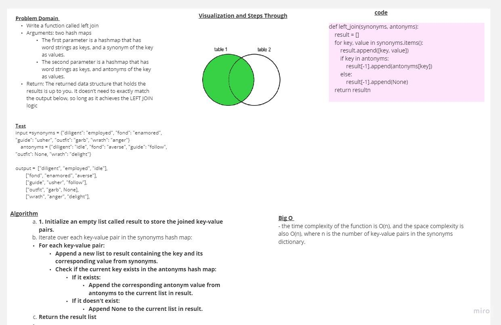

# class 32 - Hashmap-left-join

join two hash tables together and return the result as a list of lists

## Whiteboard Process

## Approach & Efficiency

time: O(n) because we loop throw the first hash table once
space: O(n) because we created hashtable which will store the first hash table values, and we have values values which can be the min(n, m) so in worse case it will be O(n)

## Solution
### [click here to the  code](./hashmap_leftjoin.py)
### [click here to the Test code](../tests/test_leftJoin.py)