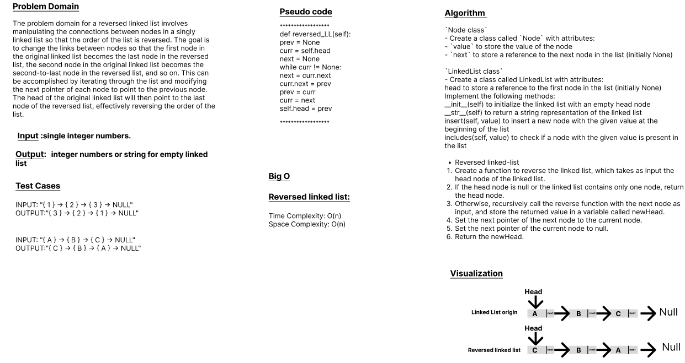

# Code Challenge: Class-09
# Reversed-Linked-List

A linked list is a data structure that consists of a sequence of nodes, where each node contains a value and a reference (or a pointer) to the next node in the sequence. A linked list can be traversed starting from the head node and following the references to the next nodes until the end of the list is reached.

To reverse a linked list, we need to change the references of each node to point to the previous node instead of the next node. The process of reversing a linked list can be done iteratively or recursively.

## Whiteboard Process

## Approach & Efficiency
## 1. Algorithm :
`Node class`
- Create a class called `Node` with attributes:
- `value` to store the value of the node
- `next` to store a reference to the next node in the list (initially None)

`LinkedList class`
- Create a class called LinkedList with attributes:
 
 head to store a reference to the first node in the list (initially None)
    Implement the following methods:
     __init__(self) to initialize the linked list with an empty head node
     __str__(self) to return a string representation of the linked list
     insert(self, value) to insert a new node with the given value at the beginning of the list
     includes(self, value) to check if a node with the given value is present in the list

- Reversed linked-list

1. Create a function to reverse the linked list, which takes as input the head node of the linked list.

2. If the head node is null or the linked list contains only one node, return the head node.

3. Otherwise, recursively call the reverse function with the next node as input, and store the returned value in a variable called newHead.

4. Set the next pointer of the next node to the current node.

5. Set the next pointer of the current node to null.

6. Return the newHead.

## 2. BigO
  
The time complexity of the `Reversed Linked List` is `O(n)`, where n is the length of the linked list.
The space complexity of this method is `O(n)`.

## Solution
### [click here to the LinkedList code](./reversedLL.py)
### [click here to the Test code](../tests/test_linkedlist5.py)
### To run the code:
    -on your terminal follow these command:
       1. source .venv/bin/activate.
       2. pip install pytest.
       3. pytest.