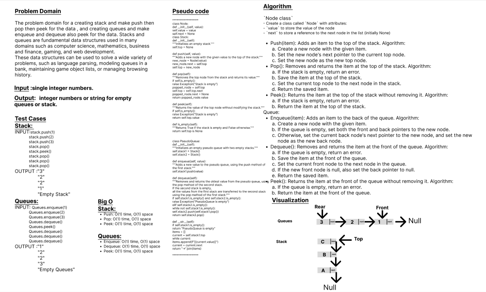

# Code Challenge: Class-12
# stack-and-queue 
A queue is a First-In-First-Out (FIFO) data structure in which the first element added is the first one to be removed. The main operations performed on a queue are enqueue (add an element to the back) and dequeue (remove the front element). Other common operations include peek (return the front element without removing it) and isEmpty (check if the queue is empty).

## Whiteboard Process

## Approach & Efficiency
## 1. Algorithm :
`Node class`
- Create a class called `Node` with attributes:
- `value` to store the value of the node
- `next` to store a reference to the next node in the list (initially None)

`LinkedList class`
- Create a class called LinkedList with attributes:
 
 head to store a reference to the first node in the list (initially None)
    Implement the following methods:
     __init__(self) to initialize the linked list with an empty head node
     __str__(self) to return a string representation of the linked list
     insert(self, value) to insert a new node with the given value at the beginning of the list
     includes(self, value) to check if a node with the given value is present in the list

- Queue:

Enqueue: Create a new node with the given value and set its next pointer to null. If the queue is empty, set both the front and rear pointers to the new node. Otherwise, set the next pointer of the current rear node to the new node and update the rear pointer to the new node. Time complexity: O(1).
Dequeue: Check if the queue is empty. If not, remove the front node from the queue and return its value. Update the front pointer to the next node in the queue. If the front node is now null, update the rear pointer to null as well. Time complexity: O(1).
Peek: Check if the queue is empty. If not, return the value of the front node in the queue. Time complexity: O(1).
Is Empty: Check if both the front and rear pointers are null. If so, the queue is empty.

## 2. BigO
  Here are the time complexity (big O) for various operations related queues:

Queue:

enqueue: O(1)
dequeue: O(1)
peek: O(1)
is_empty: O(1)

Here are the space complexity (big O) for various operations related to stacks and queues:

For a `queue`, the space complexity is also proportional to the number of elements stored in the queue. Each element requires a Node object with a value and a pointer to the next node. Therefore, the space complexity of a queue is also O(n), where n is the number of elements in the queue.

## Solution
### [click here to the stack and queues code](./s_q_animal-shelter.py)
### [click here to the Test code](../tests/test_s_q_animal_shelter.py)
### To run the code:
    -on your terminal follow these command:
       1. source .venv/bin/activate.
       2. pip install pytest.
       3. pytest.