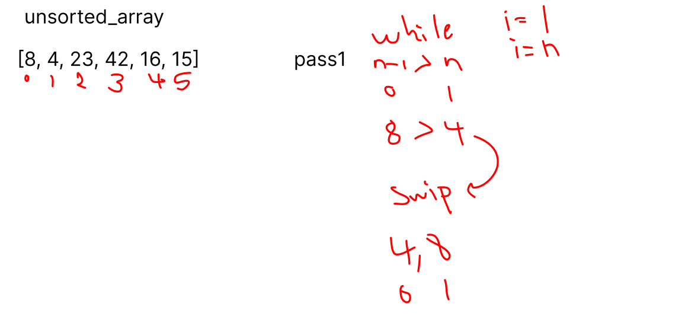
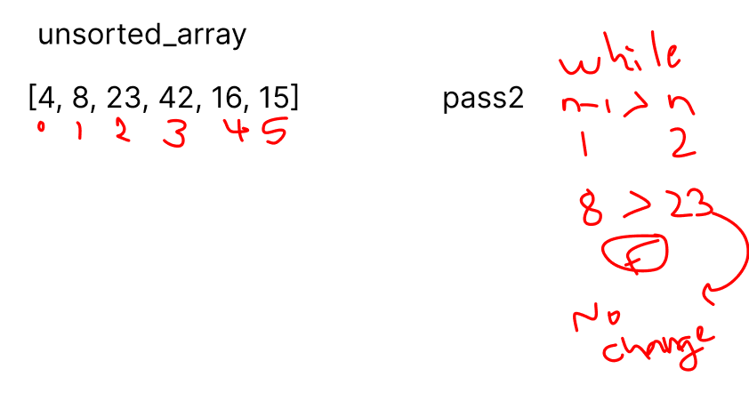
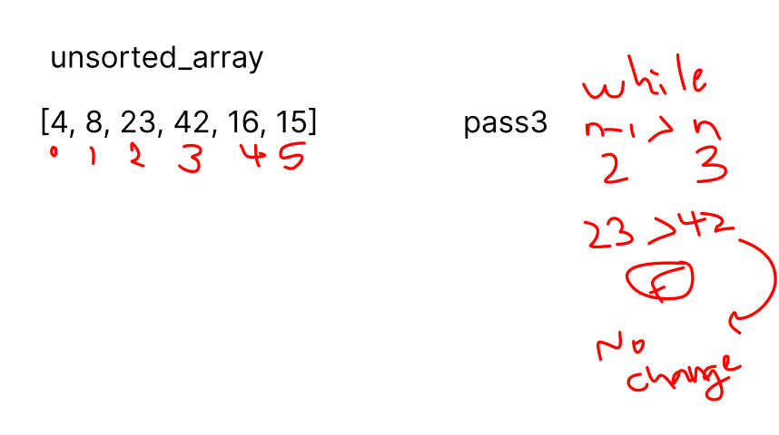
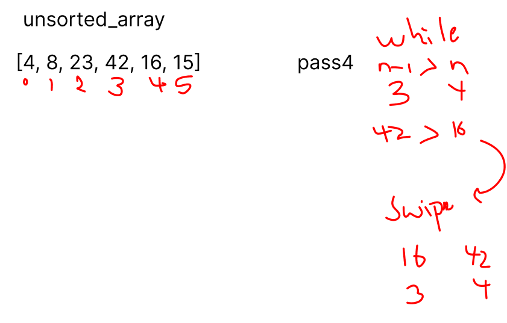
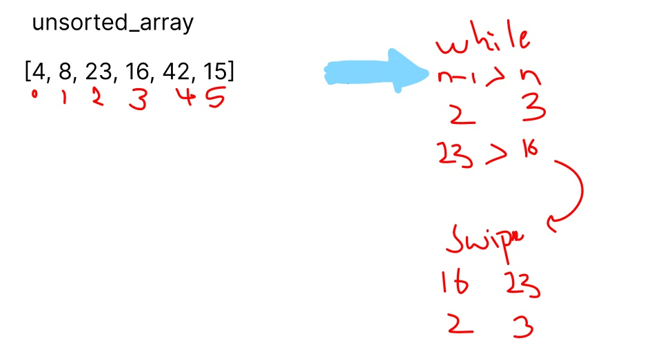
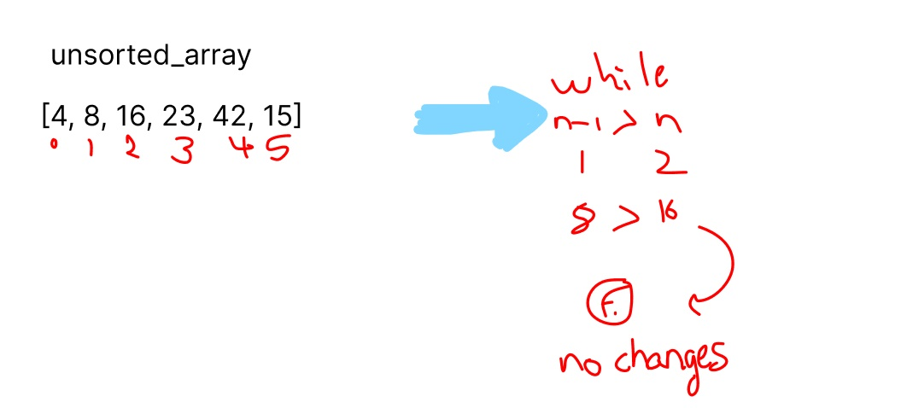
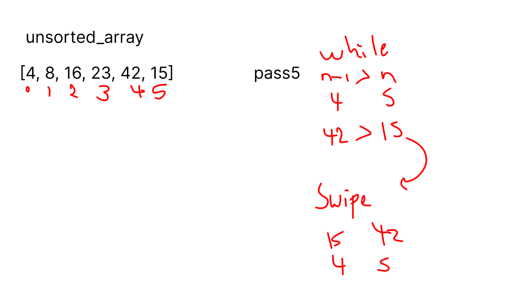
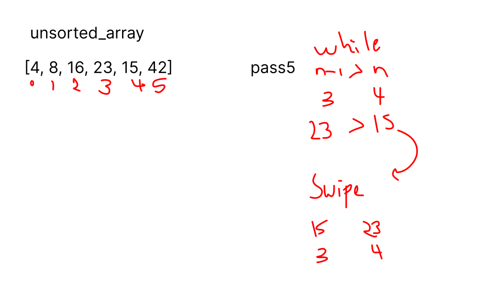
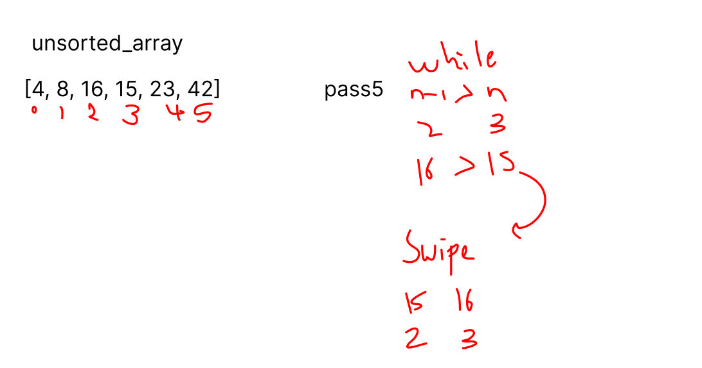
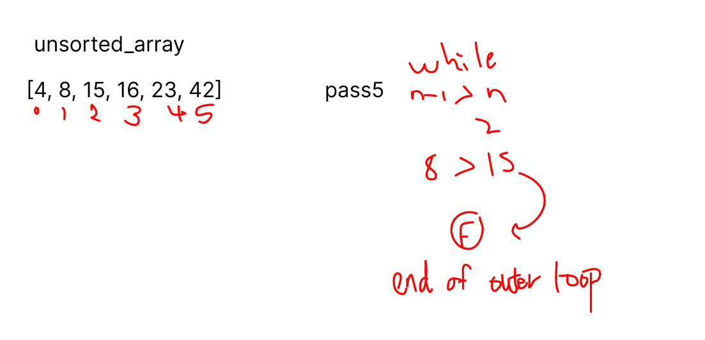

# InsertionSort
## Insertion sort is a simple sorting algorithm that builds the final sorted array (or list) one item at a time by comparisons.

## Time Complexities

- ## Worst Case Complexity: O(n2) : Suppose, an array is in ascending order, and you want to sort it in descending order. In this case, worst case complexity occurs. Each element has to be compared with each of the other elements so, for every nth element, (n-1) number of comparisons are made.

- ## Best Case Complexity: O(n) : When the array is already sorted, the outer loop runs for n number of times whereas the inner loop does not run at all. So, there are only n number of comparisons. Thus, complexity is linear.

## Space Complexity : 
- ## Space complexity is O(1) because an extra variable key is used.
# Trace

## pass1

## Here, 8 is greater than 4 hence they are not in the ascending order and 8 is not at its correct position. Thus, swap 4 and 8.

## pass2

## Here, 23 is greater than 8, thus both elements seems to be in ascending order, hence, no swapping will occur. 

## pass3

## Here, 42 is greater than 23, thus both elements seems to be in ascending order, hence, no swapping will occur. 

## pass4

## Here, 42 is greater than 16 hence they are not in the ascending order and 16 is not at its correct position. Thus, swap 16 and 42.

## Here, 23 is greater than 16 hence they are not in the ascending order and 16 is not at its correct position. Thus, swap 16 and 23.

## Here, 16 is greater than 8, thus both elements seems to be in ascending order, hence, no swapping will occur. 

## pass5

## Here, 42 is greater than 15 hence they are not in the ascending order and 15 is not at its correct position. Thus, swap 15 and 42.

## Here, 23 is greater than 15 hence they are not in the ascending order and 15 is not at its correct position. Thus, swap 15 and 23.

## Here, 16 is greater than 15 hence they are not in the ascending order and 15 is not at its correct position. Thus, swap 15 and 16.

## Here, 15 is greater than 8, thus both elements seems to be in ascending order, hence, no swapping will occur.

    - Finally, the array is completely sorted.

## Link of the code
### [click here to the InsertionSort code](./InsertionSort.py)
### [click here to the InsertionSort test](../../tests/test_sorting_insertion.py)

