# MergeSort
## Merge sort is defined as a sorting algorithm that works by dividing an array into smaller subarrays, sorting each subarray, and then merging the sorted subarrays back together to form the final sorted array.

# Trace

## Unsorted Array

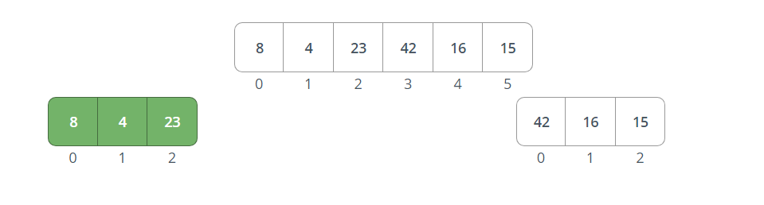
## Devied the array into 2 parts by /2 (left and right )

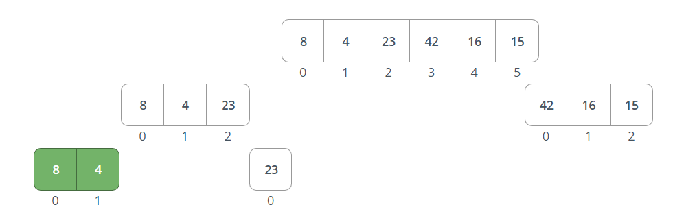
## Devied the left array into 2 parts by /2 (left and right )

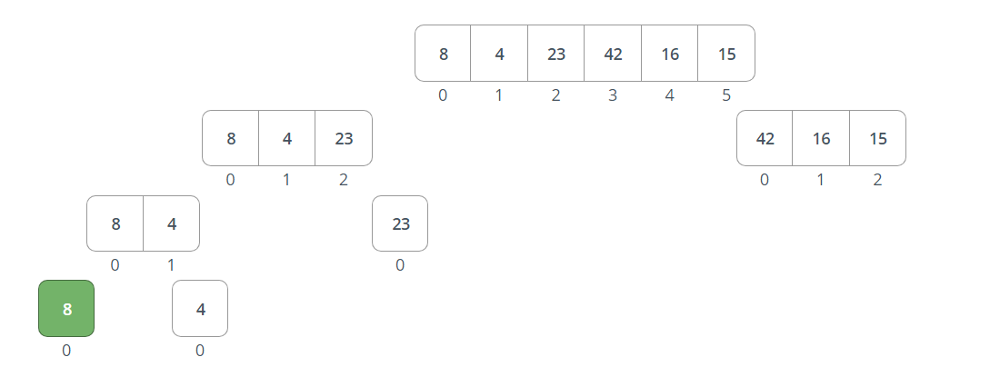
## Devied the left of the left array into 2 parts by /2 (left and right )

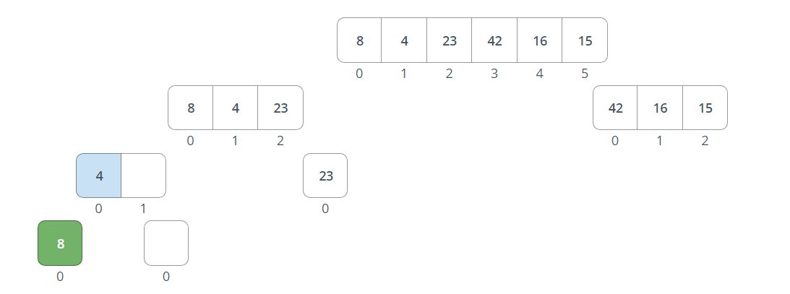
## Here, 8 is greater than 4 so indix 0 will be 4 and indix 1 will be 8.

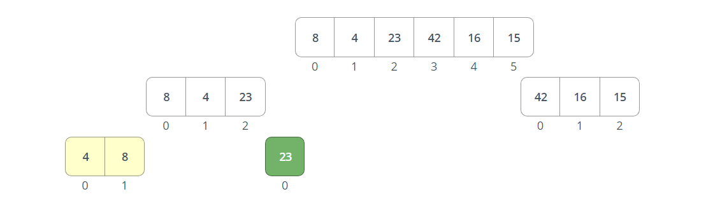
## Here, 23 is greater than 4 so indix 0 will be 4 and then compare 23 with 8 so indix 1 will be 8 finally indix 2 will be 23.

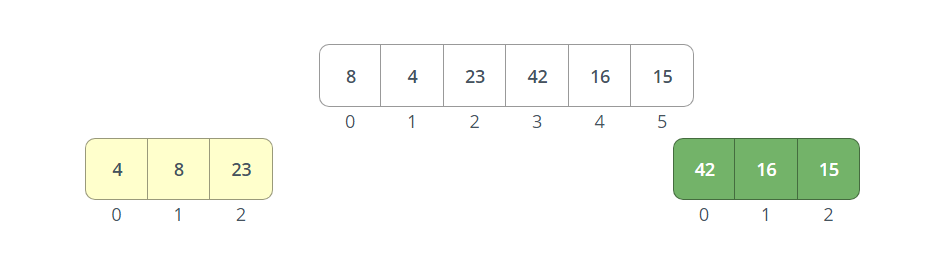
## done from the left array.

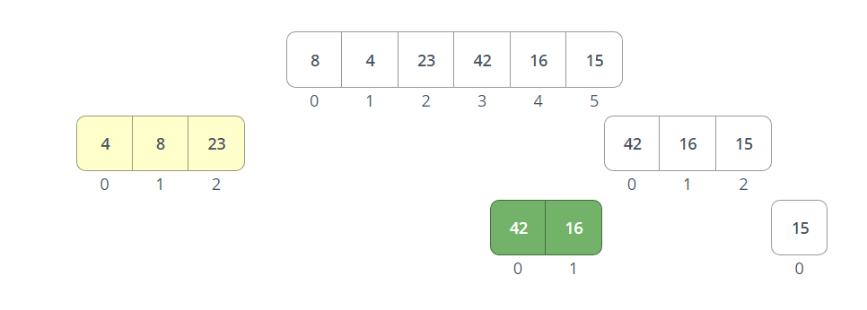
## Devied the right array into 2 parts by /2 (left and right )

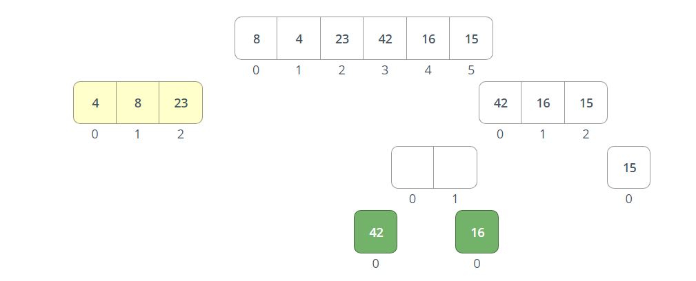
## Devied the left of the right array into 2 parts by /2 (left and right )

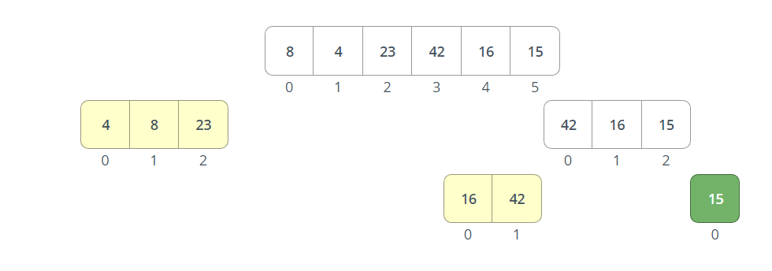
## Here, 42 is greater than 16 so indix 0 will be 42 and indix 1 will be 16.

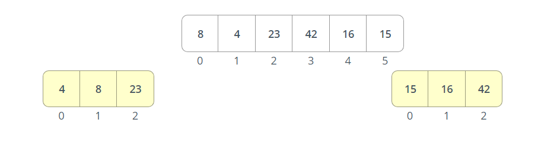
## Here, 16 is greater than 15 so indix 0 will be 15 and then compare 16 with 42 so indix 1 will be 16 finally indix 2 will be 42.

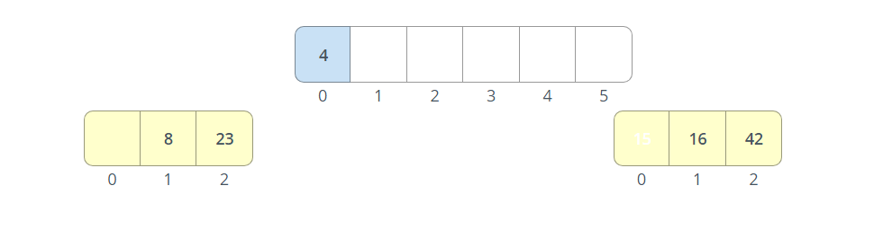
## Here, 15 is greater than 4 so indix 0 will be 4 and also 15 graeter than 8 so indix 1 will be 8 .

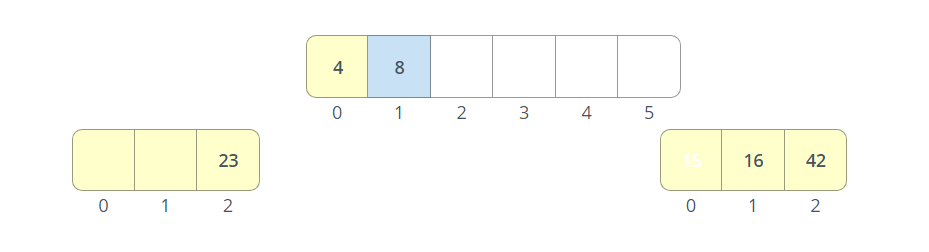

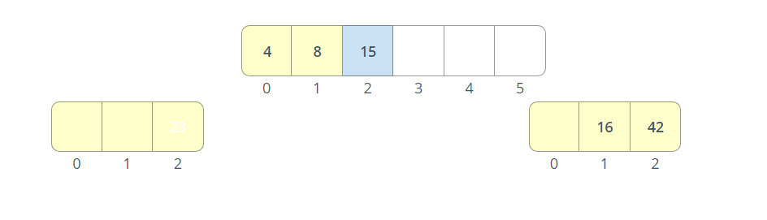
## Here, 23 is greater than 15 so indix 2 will be 15.

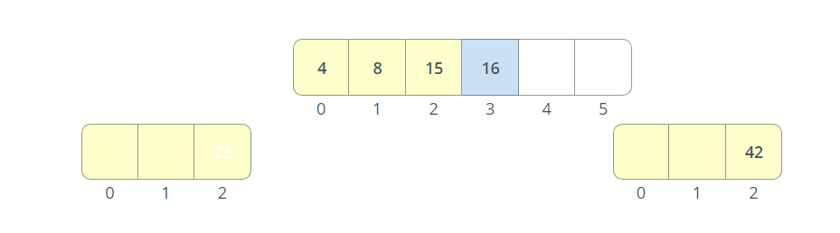
## Here, 23 is greater than 16 so indix 3 will be 16.

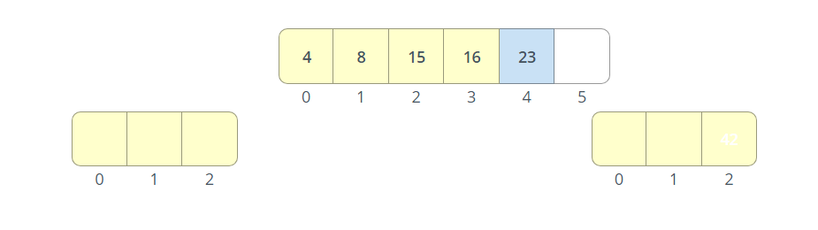
## Here, 42 is greater than 23 so indix 4 will be 23.
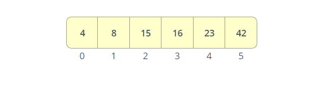
## Here, the end of the right array.

    - Finally, the array is completely sorted.

## Link of the code
### [click here to the sortingMerge code](./merge.py)
### [click here to the sortingMerge test](../../tests/test_sorting_merge.py)