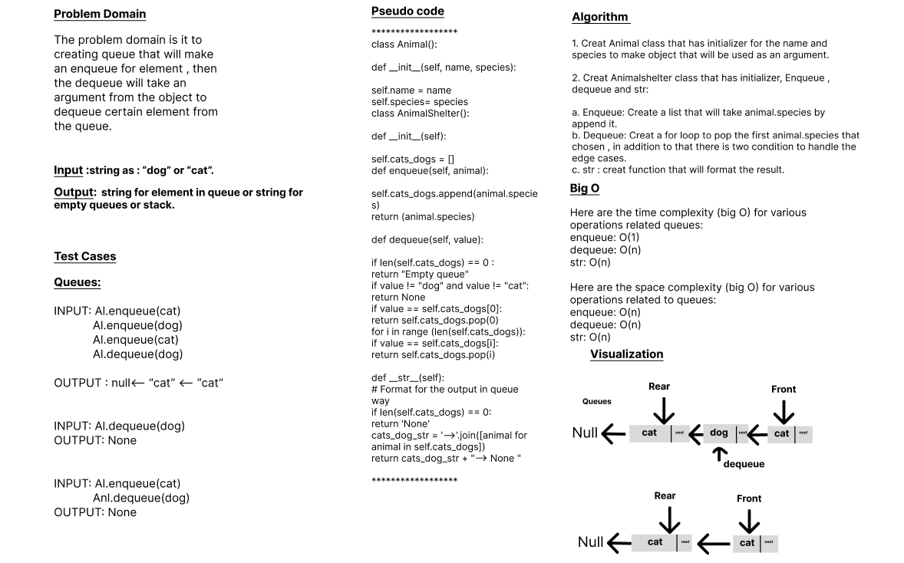

# Code Challenge: Class-13
# stack-and-queue 
### Problem Domain

The problem domain is it to  creating stack that check about the input if it is acceptable or not and give us a boolean value, so arguments: string
then return: boolean  
The code should design to check whether the brackets in a given string are balanced or not. It verifies the correct placement and matching of three types of brackets: round brackets "()", square brackets "[]", and curly brackets "{}".

## Whiteboard Process

## Approach & Efficiency
## 1. Algorithm :

creat function called validate_brackets that takes a string as input.

Initialize an empty stack data structure to store opening brackets encountered during iteration.

Define a dictionary bracket_pairs that maps opening brackets to their corresponding closing brackets.

Iterate over each character char in the input string.

If char is an opening bracket (exists as a key in bracket_pairs), push it onto the stack.

If char is a closing bracket (exists as a value in bracket_pairs), perform the following steps:

    If the stack is empty, return False since there is no opening bracket to match the closing bracket.
    Pop the last encountered opening bracket from the stack and store it in a variable opening_bracket.
    Compare char with the corresponding closing bracket in bracket_pairs using opening_bracket as the key.
    If they do not match, return False as the brackets are not balanced.

After the iteration completes, check if the stack is empty:

    If it is empty, return True as all opening brackets were matched and popped.
    If it is not empty, return False as there are unmatched opening brackets remaining.  

## 2. BigO
Here are the `time complexity` (big O) for various operations related queues:
 O(n) time complexity

Here are the `space complexity` (big O) for various operations related to queues:
 O(n) time complexity

## Solution
### [click here to the code](./stack_queue_brackets.py)
### [click here to the Test code](../tests/test_stack_queue_brackets.py)

## Test Cases

      Input	                           Output
        {}	                            TRUE
        {}(){}	                        TRUE
        ()[[Extra Characters]]	        TRUE
        (){}[[]]	                    TRUE
        {}{Code}[Fellows](())	        TRUE
        [({}]	                        FALSE
        (](	                            FALSE
        {(})	                        FALSE 

### To run the code:
    -on your terminal follow these command:
       1. source .venv/bin/activate.
       2. pip install pytest.
       3. pytest.