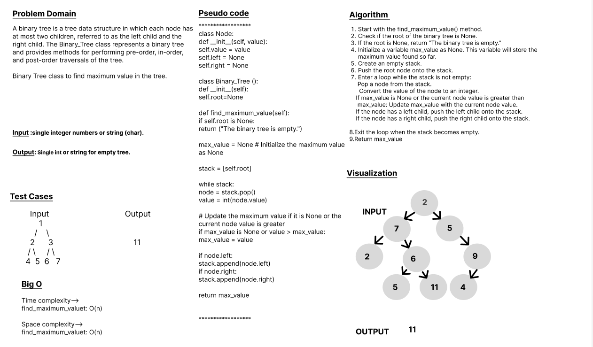

# Code Challenge: Class-16
# Trees
### Problem Domain

A binary tree is a tree data structure in which each node has at most two children, referred to as the left child and the right child. The Binary_Tree class represents a binary tree and provides methods for performing pre-order, in-order, and post-order traversals of the tree.

Binary Tree class to find maximum value in the tree.

## Whiteboard Process

## Approach & Efficiency
## 1. Algorithm :
1. Start with the find_maximum_value() method.
2. Check if the root of the binary tree is None.
3. If the root is None, return "The binary tree is empty."
4. Initialize a variable max_value as None. This variable will store the maximum value found so far.
5. Create an empty stack.
6. Push the root node onto the stack.
7. Enter a loop while the stack is not empty:
    >Pop a node from the stack.

    > Convert the value of the node to an integer.
     
     >If max_value is None or the current node value is greater than max_value: Update max_value with the current node value.

    > If the node has a left child, push the left child onto the stack.

    >If the node has a right child, push the right child onto the stack.

8. Exit the loop when the stack becomes empty.
9. Return max_value

## 2. BigO
Here are the `time complexity` (big O) for various operations:

        find_maximum_value: O(n) 

Here are the `space complexity` (big O) for various operations:

        find_maximum_value: O(n) 
 

## Solution
### [click here to the code](./tree_max.py)
### [click here to the Test code](../tests/test_max_tree.py)

## Test Cases

      Input	                                     Output
           2
       /       \ 
      7         5
     / \         /                                 11
    2   6       9
       / \     /
      5  11   4

### To run the code:
    -on your terminal follow these command:
       1. source .venv/bin/activate.
       2. pip install pytest.
       3. pytest.