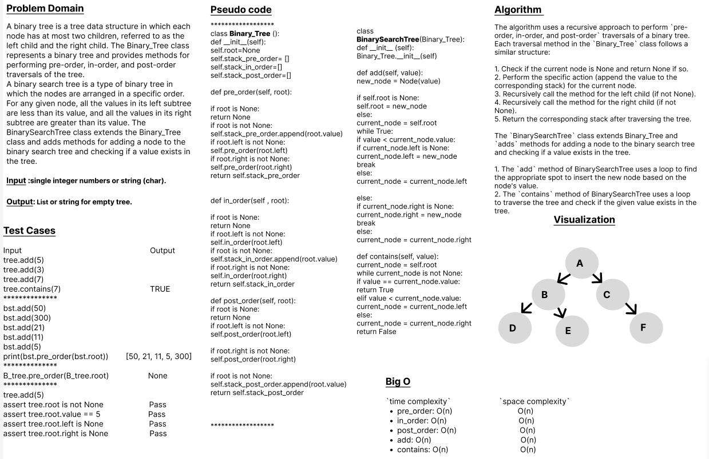

# Code Challenge: Class-15
# Trees
### Problem Domain

A binary tree is a tree data structure in which each node has at most two children, referred to as the left child and the right child. The Binary_Tree class represents a binary tree and provides methods for performing pre-order, in-order, and post-order traversals of the tree.

A binary search tree is a type of binary tree in which the nodes are arranged in a specific order. For any given node, all the values in its left subtree are less than its value, and all the values in its right subtree are greater than its value. The BinarySearchTree class extends the Binary_Tree class and adds methods for adding a node to the binary search tree and checking if a value exists in the tree.

## Whiteboard Process

## Approach & Efficiency
## 1. Algorithm :
The algorithm uses a recursive approach to perform `pre-order, in-order, and post-order` traversals of a binary tree.
Each traversal method in the `Binary_Tree` class follows a similar structure:

1. Check if the current node is None and return None if so.
2. Perform the specific action (append the value to the corresponding stack) for the current node.
3. Recursively call the method for the left child (if not None).
4. Recursively call the method for the right child (if not None).
5. Return the corresponding stack after traversing the tree.

The `BinarySearchTree` class extends Binary_Tree and `adds` methods for adding a node to the binary search tree and checking if a value exists in the tree.

1. The `add` method of BinarySearchTree uses a loop to find the appropriate spot to insert the new node based on the node's value.
2. The `contains` method of BinarySearchTree uses a loop to traverse the tree and check if the given value exists in the tree.
 

## 2. BigO
Here are the `time complexity` (big O) for various operations:

        pre_order: O(n) 
        in_order: O(n) 
        post_order: O(n) 
        add: O(n) 
        contains: O(n) 

Here are the `space complexity` (big O) for various operations:

        pre_order: O(n) 
        in_order: O(n) 
        post_order: O(n) 
        add: O(n) 
        contains: O(n) 

## Solution
### [click here to the code](./trees.py)
### [click here to the Test code](../tests/test_trees.py)

## Test Cases

      Input	                                     Output
    tree.add(5)
    tree.add(3)
    tree.add(7)
    tree.contains(7)         	                  TRUE
    **************
    bst.add(50)
    bst.add(300)
    bst.add(21)
    bst.add(11)
    bst.add(5)
    bst.add(15)
    print(bst.pre_order(bst.root))        [50, 21, 11, 5, 15, 300]
    **************
    B_tree.pre_order(B_tree.root)                 None
    **************
    tree.add(5)
    assert tree.root is not None                  Pass
    assert tree.root.value == 5                   Pass
    assert tree.root.left is None                 Pass 
    assert tree.root.right is None                Pass

### To run the code:
    -on your terminal follow these command:
       1. source .venv/bin/activate.
       2. pip install pytest.
       3. pytest.